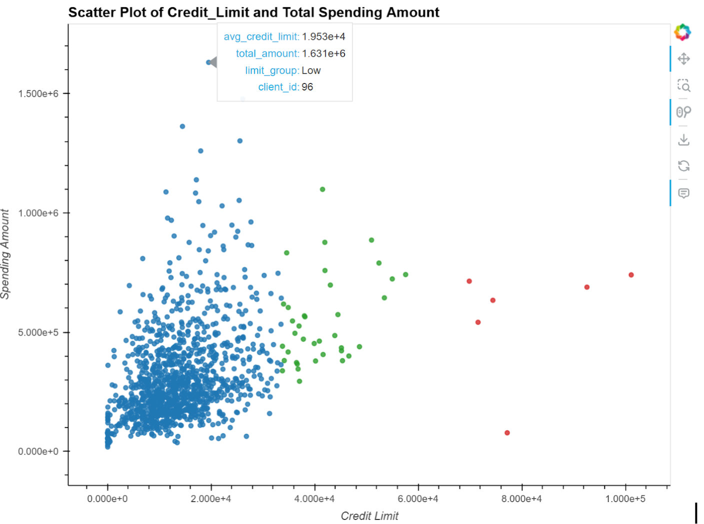
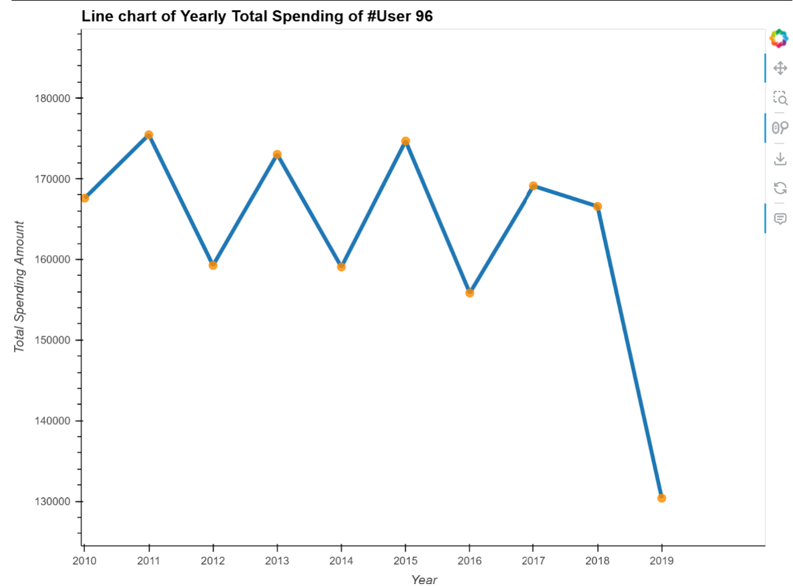
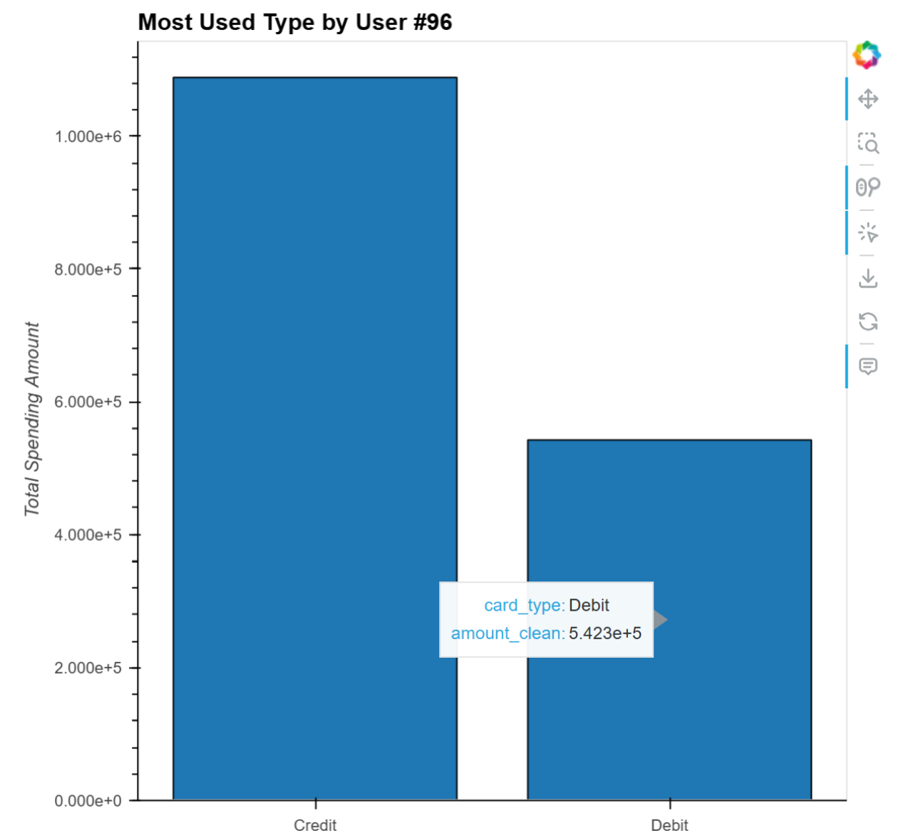

# Python_Data_Analysis_Project

# 💳 Credit Card Transactional Data Analysis | Python

## 📚 Project Overview

This project analyzes credit card transaction behaviors using multiple datasets, including transaction histories, cardholder profiles, and fraud detection labels.

The goals of the project are:
- Explore seasonal spending behavior across different card brands.
- Analyze the relationship between client credit limits and their spending behavior.
- Investigate characteristics and patterns of fraudulent transactions.

> 📌 **Note:**  
> This project was completed as part of a group effort.  
> It covers a wide range of data analysis topics across multiple areas.  
> Given the project's large scope, this README focuses mainly on the part I was responsible for
— an in-depth analysis of the relationship between client credit limits and their spending behaviors — which I believe is particularly meaningful and demonstrates strong business insight.

---

## 🧠 My Contribution: Credit Limit vs Spending Behavior Analysis

I specifically led the analysis for **Research Question 2**, which focused on exploring how client spending behavior relates to their credit limits.

### Key Steps

---

#### 1. Data Preparation

- **Combining Datasets**  
  Merged three data sources to create the analytical base:
  - `transactions_data.csv` was joined with `train_fraud_labels.json` using `transaction_id`.
  - The resulting dataframe was then merged with `cards_data.csv` using `card_id`.
  - This process combined transaction details, fraud labels, and card information into a single dataset (`merged_df`) for further analysis.

- **Data Cleaning**  
  Focused on ensuring the correct formatting of the columns needed for analysis: `amount`, `credit_limit`, and `date`.  
  - Cleaned `amount` and `credit_limit` column by removing the dollar sign and converting them to a float data type.
  - `date` datatype to DATE.
  - Extracted the year, month from the `date` field to enable year-based aggregation.
  - 
- **Feature Engineering**  
  - Created `client_spend_df` by grouping data by `client_ID` and summing the total spending amount.
  - Created `client_credit_limit_df` by grouping data by `client_ID` and calculating the average credit limit.
  - Merged the two client-level datasets for integrated analysis of spending behavior and credit limits.
  - Segmented clients into "Low," "Medium," and "High" credit limit groups based on real-world thresholds.

---

#### 2. Correlation Analysis

- **Spending vs Credit Limit Relationship**  
  Calculated the correlation between total spending amount and average credit limit, resulting in a coefficient of **0.4077**, indicating a moderate positive correlation.  
  ➔ **Interpretation:** As credit limits increase, spending tends to increase as well.

- **Scatter Plot Visualization**  
  Created scatter plots using Holoviews to illustrate the distribution of clients across different credit limit and spending ranges.  
  ➔ **Findings:**  
  - Clients in the low credit limit group generally spent less.  
  - Medium and high limit groups showed higher spending, following an upward trend.
  
 

---

#### 3. Outlier Detection and Deep Dive

- **Outlier Identification**  
  Detected an outlier: a client belonging to the **low credit limit group**, yet demonstrating the highest spending across the dataset.  
  ➔ This anomaly prompted a deeper investigation.

- **User Profile Analysis**  
  Retrieved the client's demographic and financial profile (user_id = 96) from the user dataset:
  - **Income:** $99,825 (financially stable)
  - **Total Debt:** $4,344 (low debt burden)
  - **Credit Score:** 685 (solid)

---

#### 4. Behavioral Pattern Analysis

- **Spending Pattern Over Time**  
  Visualized the client's annual spending trends:
  - Spending was consistently higher in **odd-numbered years** (e.g., 2011, 2013, 2015).
  - A notable spending drop occurred in 2019, potentially influenced by external events such as the COVID-19 pandemic.
  
 
 
- **Card Type Usage Analysis**  
  Analyzed the client's total spending across different card types:
  - Although credit cards were used more frequently, debit card spending remained significant.
  - This presents an opportunity to encourage greater credit card usage through targeted promotions.
 

---

## 📈 Business Insights (If Acting as a Credit Card Company)

- The client represents a **high-value customer** with strong financial indicators.
- She could be a good candidate for **targeted promotions** or **credit limit increases** to enhance loyalty.
- Offering **higher rewards during odd-numbered years** could match her spending cycle and maximize engagement.
- **Encouraging more debit-to-credit shift** via customized offers could further increase profitability and customer retention.

---

## 🛠 Tools and Technologies

- Python (Pandas, Holoviews, Bokeh, Matplotlib)
- Exploratory Data Analysis (EDA)
- Correlation Analysis
- Outlier Detection
- Client Segmentation

---
